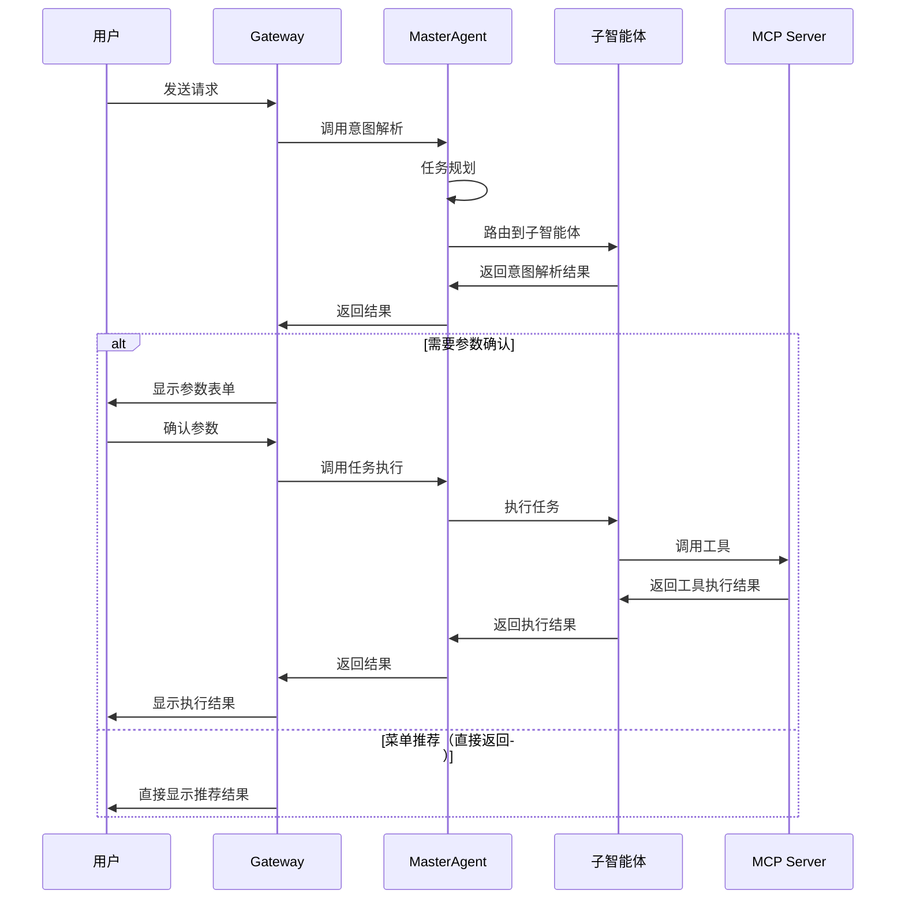
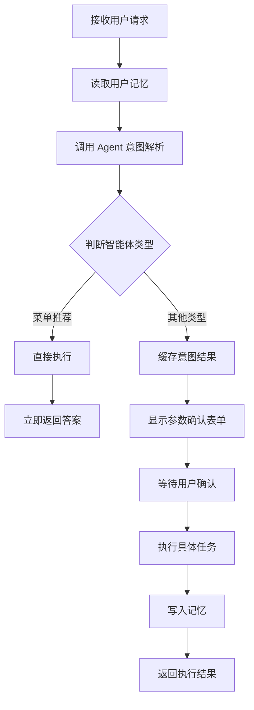
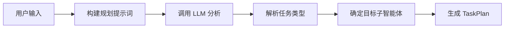
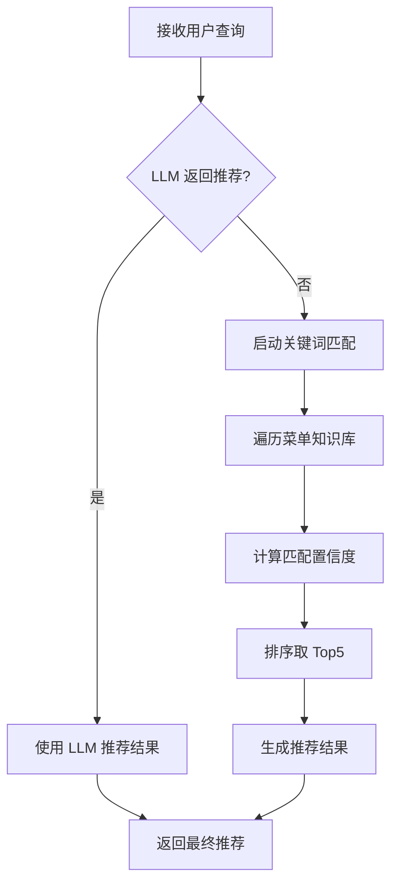
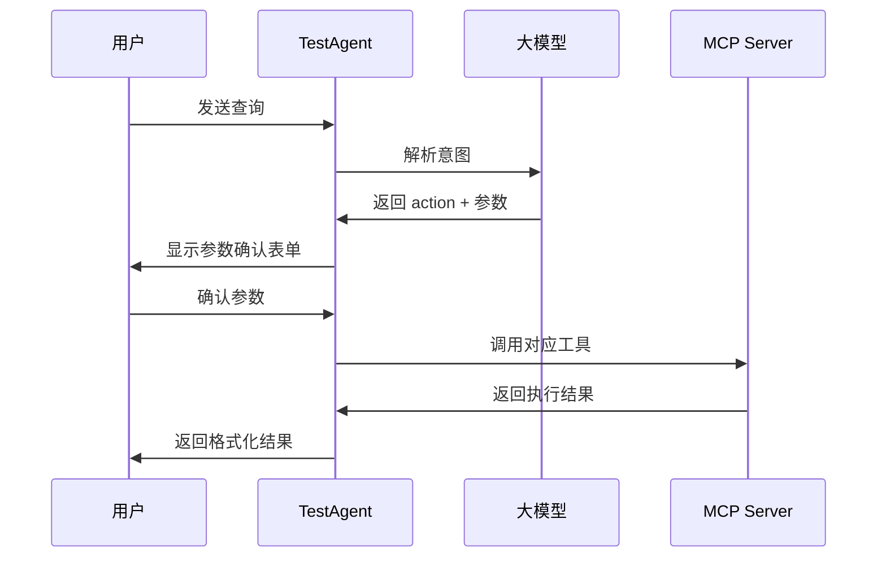
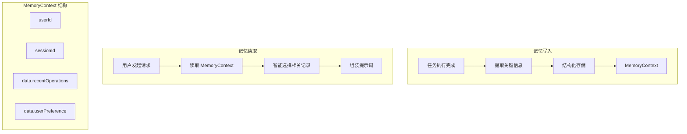
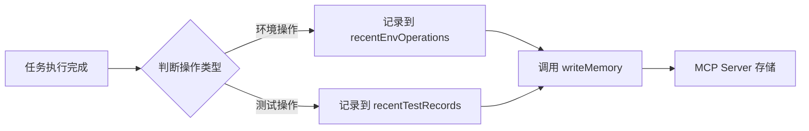
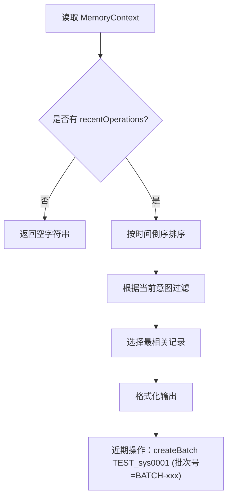
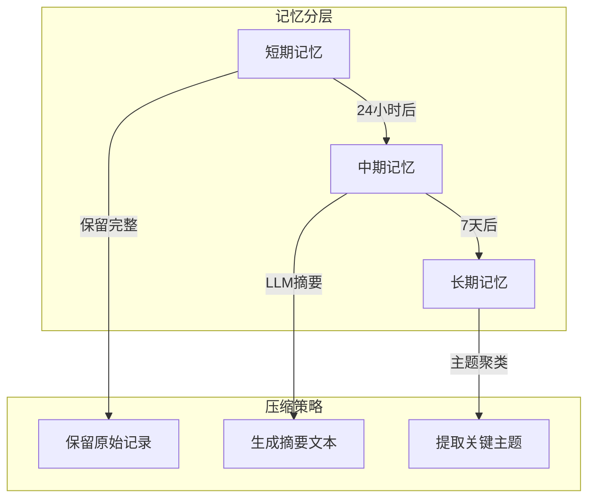

# 研发支持智能体系统架构设计文档

## 1. 系统概述

研发支持智能体系统是一个基于多智能体架构的智能助手平台，旨在帮助用户高效地完成环境管理、测试执行和菜单导航等研发支持任务。系统采用分层架构设计，包含网关层（Gateway）、主控层（MasterAgent）和子智能体层（SubAgent），通过上下文管理机制实现智能对话和任务执行。

## 2. 总体架构

### 2.1 架构分层

```
┌─────────────────────────────────────────────────────────────┐
│                        前端层 (Web UI)                        │
│                  React/Vue 单页应用                           │
└─────────────────────────────────────────────────────────────┘
                              │
                              ▼
┌─────────────────────────────────────────────────────────────┐
│                      网关层 (Gateway)                         │
│  ┌──────────────┐  ┌──────────────┐  ┌──────────────┐      │
│  │ AgentService │  │ MemoryClient │  │  AgentClient │      │
│  └──────────────┘  └──────────────┘  └──────────────┘      │
│       业务编排        记忆读写          子服务调用             │
└─────────────────────────────────────────────────────────────┘
                              │
                              ▼
┌─────────────────────────────────────────────────────────────┐
│                     主控层 (MasterAgent)                      │
│                     Plan-and-Execute                         │
│  ┌──────────────┐  ┌──────────────┐  ┌──────────────┐      │
│  │  任务规划     │  │  智能路由     │  │  结果整合     │      │
│  └──────────────┘  └──────────────┘  └──────────────┘      │
└─────────────────────────────────────────────────────────────┘
                              │
              ┌───────────────┼───────────────┐
              ▼               ▼               ▼
┌─────────────────┐ ┌─────────────────┐ ┌─────────────────┐
│ MenuRecommendation│ │    TestAgent    │ │  EnvManagement  │
│     Agent        │ │                 │ │     Agent       │
│  (菜单推荐)       │ │  (测试执行)      │ │  (环境管理)      │
└─────────────────┘ └─────────────────┘ └─────────────────┘
                              │
                              ▼
┌─────────────────────────────────────────────────────────────┐
│                     工具层 (MCP Server)                       │
│  ┌──────────────┐  ┌──────────────┐  ┌──────────────┐      │
│  │  TestTools   │  │ MemoryService │  │  其他工具     │      │
│  └──────────────┘  └──────────────┘  └──────────────┘      │
└─────────────────────────────────────────────────────────────┘
```

### 2.2 交互流程



## 3. 各组件处理逻辑

### 3.1 Gateway 层处理逻辑

Gateway 是系统的统一入口，负责请求路由、协议转换和上下文管理。

#### 3.1.1 核心职责

1. **请求预处理**：接收用户请求，提取用户ID、会话ID等信息
2. **记忆读取**：调用 MemoryClient 读取用户历史记忆
3. **请求组装**：将用户查询与历史记忆组装成带上下文的提示词
4. **智能路由**：根据请求类型决定调用路径
5. **结果缓存**：临时存储意图解析结果，支持多轮交互

#### 3.1.2 特殊处理：菜单推荐的单轮模式

Gateway 对不同类型的智能体采用不同的处理策略：



对于 MenuRecommendationAgent，系统检测到 `action` 以 `recommendMenu` 开头时，会直接调用执行方法并返回结果，跳过参数确认和第二轮交互流程。

### 3.2 MasterAgent 层处理逻辑

MasterAgent 采用 **Plan-and-Execute** 模式，负责任务规划和智能路由。

#### 3.2.1 任务规划流程



任务规划时，MasterAgent 会根据关键词匹配规则进行兜底判断：
- **菜单推荐关键词**："菜单"、"推荐"、"在哪"、"怎么"、"如何"
- **环境管理关键词**："环境"、"资源"、"申请"、"回收"
- **测试执行关键词**："测试"、"接口"、"批次"、"案例"、"执行"

#### 3.2.2 路由决策表

| 任务类型 | 目标子智能体 | 需要确认 | 典型场景 |
|---------|-------------|---------|---------|
| MENU_RECOMMENDATION | MenuRecommendationAgent | 否 | "创建批次在哪？" |
| TEST_EXECUTION | TestAgent | 是 | "创建一个测试批次" |
| ENV_MANAGEMENT | EnvManagementAgent | 是 | "申请开发环境" |

### 3.3 MenuRecommendationAgent 处理逻辑

MenuRecommendationAgent 是专门用于菜单推荐的子智能体，其特点是**无状态、单轮交互、直接返回**。

#### 3.3.1 双重推荐机制



#### 3.3.2 菜单知识库结构

```
接口测试
├── 创建批次 (关键词: 创建批次、新建批次、批次管理)
├── 添加案例到批次 (关键词: 添加案例、加入案例)
├── 执行批次 (关键词: 执行批次、运行批次、开始测试)
└── 分析执行结果 (关键词: 分析结果、查看报告)

环境管理
├── 申请资源 (关键词: 申请环境、创建环境)
├── 回收资源 (关键词: 回收环境、释放资源)
├── 查看资源状态 (关键词: 查看环境、资源状态)
└── 资源续期 (关键词: 续期、延长、扩容)
```

置信度计算公式：
- 菜单路径匹配：+0.5
- 关键词匹配：每个 +0.3
- 描述分词匹配：每个 +0.1
- 上限：1.0

### 3.4 TestAgent 处理逻辑

TestAgent 是处理测试相关任务的子智能体，采用 **ReAct（Reasoning + Acting）** 模式。

#### 3.4.1 两阶段处理流程

**第一阶段：意图解析（Intent Parse）**
1. 构建提示词（包含系统提示词 + 用户查询 + 历史记忆）
2. 调用 LLM 解析用户意图
3. 提取 action、parameters、think 等信息
4. 返回结构化结果，包含参数确认表单

**第二阶段：任务执行（Execution）**
1. 接收用户确认后的参数
2. 根据 action 调用对应的 MCP 工具
3. 处理工具返回结果
4. 格式化输出给用户

#### 3.4.2 支持的操作类型

| Action | MCP 工具 | 功能描述 |
|-------|---------|---------|
| createBatch | createBatch | 创建测试批次 |
| addCasesToBatch | addCasesToBatch | 添加案例到批次 |
| executeBatch | executeBatch | 执行测试批次 |
| analyzeBatchResult | analyzeBatchResult | 分析执行结果 |
| autoInterfaceTest | autoInterfaceTest | 自动化接口测试 |



## 4. 上下文管理设计

### 4.1 业界上下文管理方案

在对话系统和智能助手领域，上下文管理是核心能力。业界主流方案包括：

#### 4.1.1 OpenAI 的 Conversation 模式
- 维护固定窗口的历史消息列表
- 支持 system/user/assistant/tool 四种角色
- 超出窗口时丢弃早期消息

#### 4.1.2 LangChain 的 Memory 模块
- **BufferMemory**：保留完整对话历史
- **BufferWindowMemory**：保留最近 K 轮对话
- **SummaryMemory**：使用 LLM 对历史进行摘要
- **VectorStoreMemory**：基于向量检索的相关历史

#### 4.1.3 长文本处理方案
- **RAG（Retrieval-Augmented Generation）**：向量检索 + 生成
- **滑动窗口**：固定窗口大小，丢弃过期内容
- **分层摘要**：短、中、长期记忆分层管理

### 4.2 本系统的上下文管理实现

本系统采用 **结构化记忆 + 语义检索** 的混合方案：



#### 4.2.1 记忆数据结构

```
MemoryContext
├── userId: 用户唯一标识
├── sessionId: 会话标识（支持会话隔离）
├── historyTasks: 历史任务列表
├── recentEnvOperations: 近期环境操作
├── recentTestRecords: 近期测试记录
├── userPreference: 用户偏好设置
└── data: 扩展数据字段
    ├── recentOperations: 通用操作记录
    │   ├── action: 操作类型
    │   ├── target: 操作目标
    │   ├── result: 执行结果
    │   └── timestamp: 时间戳
    └── userPreference: 偏好设置
```

#### 4.2.2 写入逻辑



写入时机的选择：
- **优势**：在执行完成后写入，确保记录的是真实发生的操作
- **考虑**：失败操作也会被记录，便于用户了解历史尝试

#### 4.2.3 读取与格式化逻辑



智能选择策略：
1. **时间倒序**：优先显示最近的操作
2. **意图匹配**：根据当前查询关键词匹配相关操作
3. **成功优先**：在相关记录中优先选择成功的操作
4. **单条展示**：避免过多历史信息干扰

#### 4.2.4 上下文隔离机制

| 隔离级别 | 实现方式 | 适用场景 |
|---------|---------|---------|
| 用户级别 | userId 区分 | 跨会话的记忆共享 |
| 会话级别 | sessionId 区分 | 单次对话的临时状态 |
| 请求级别 | requestId 区分 | 单次请求的临时缓存 |

### 4.3 上下文压缩扩展计划

当前系统暂未实现上下文压缩，随着用户使用时间增长，记忆数据会不断累积，可能导致以下问题：
- 提示词过长，超出 LLM 上下文窗口限制
- 噪声信息增多，干扰模型判断
- 响应延迟增加

#### 4.3.1 压缩策略设计

**方案一：分层摘要（推荐）**



实现思路：
- **短期记忆**（0-24小时）：保留完整操作记录，支持细节查询
- **中期记忆**（1-7天）：使用 LLM 生成摘要，保留关键信息
- **长期记忆**（7天+）：主题聚类，仅保留高频操作模式和用户偏好

**方案二：向量化检索**

```
用户查询 -> 向量化
                ↓
          向量数据库（Chroma/Milvus）
                ↓
         相似度检索 Top-K
                ↓
         返回最相关的历史记录
```

优势：
- 不受固定窗口限制
- 语义相关性强
- 可扩展性好

**方案三：关键信息提取**

在写入时即进行信息提取，只存储结构化关键字段：
```json
{
  "operation": "createBatch",
  "keyInfo": {
    "batchId": "BATCH-xxx",
    "systemName": "sys0001"
  },
  "outcome": "success",
  "timestamp": "2024-01-01T12:00:00"
}
```

#### 4.3.2 实施路线图

| 阶段 | 功能 | 优先级 |
|-----|------|-------|
| 短期 | 实现基于时间的滑动窗口，自动清理 30 天前的记录 | 高 |
| 中期 | 引入 LLM 摘要，将 7 天前的记录压缩为摘要 | 中 |
| 长期 | 集成向量数据库，实现语义检索 | 低 |

## 5. 总结

研发支持智能体系统通过分层架构实现了任务的智能分解和高效执行。Gateway 层负责请求编排和上下文管理，MasterAgent 负责任务规划和路由决策，各子智能体专注特定领域的任务处理。

上下文管理采用结构化存储 + 智能检索的方案，在满足当前需求的同时预留了压缩扩展的接口。未来可通过分层摘要、向量化检索等技术进一步优化长程对话体验。

系统的设计充分考虑了不同智能体的特性差异，如 MenuRecommendationAgent 的单轮模式、TestAgent 的两轮确认模式，实现了灵活与规范的平衡。
