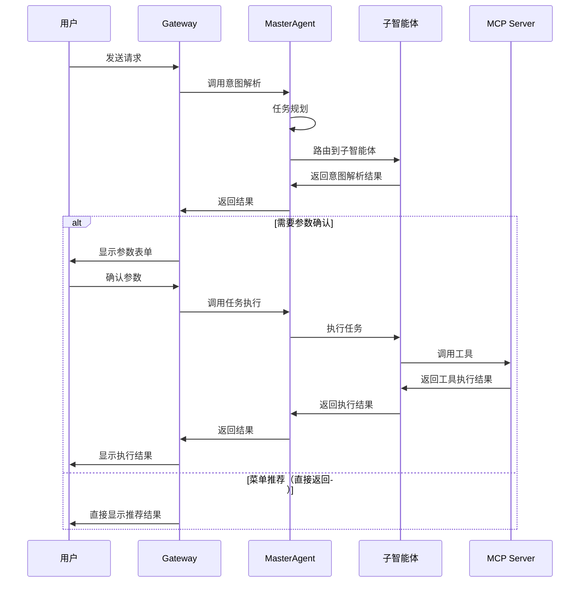
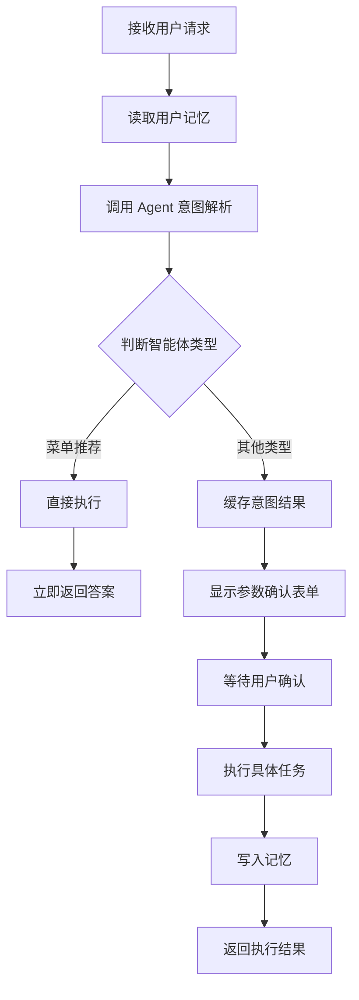
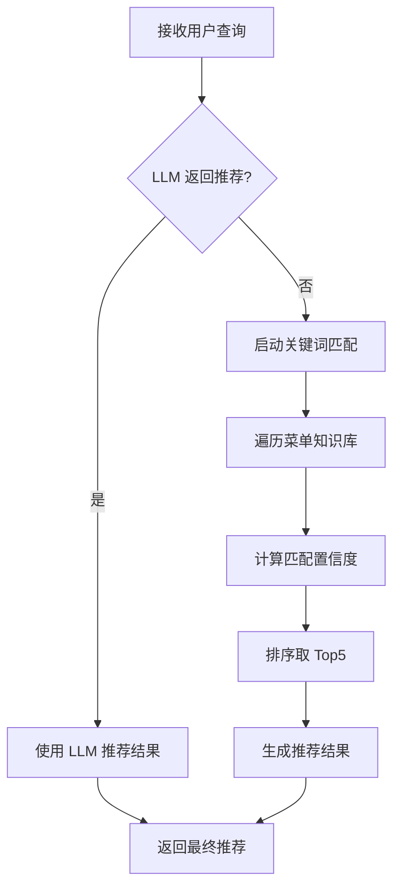
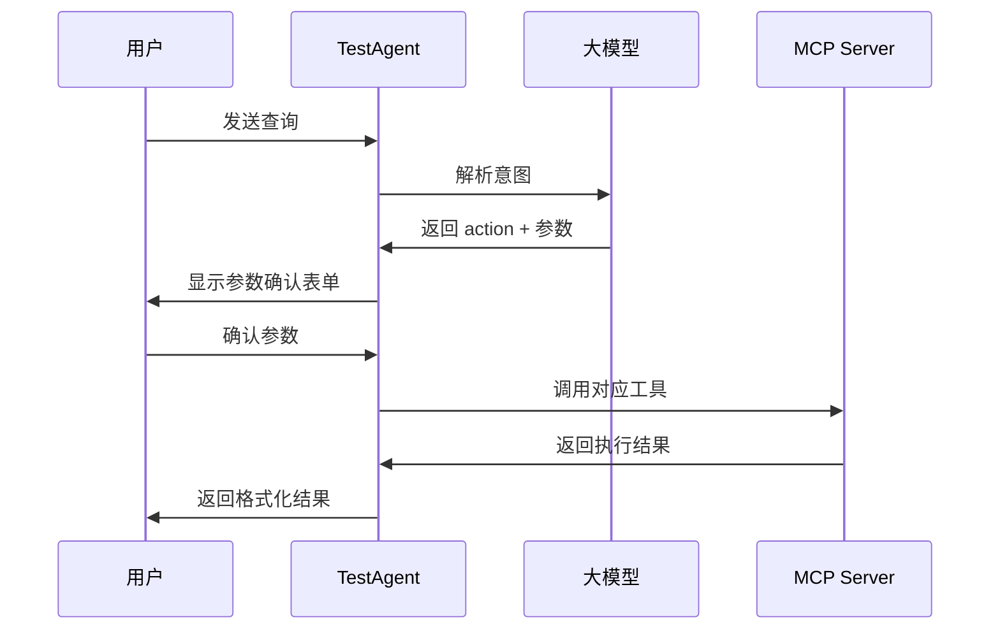
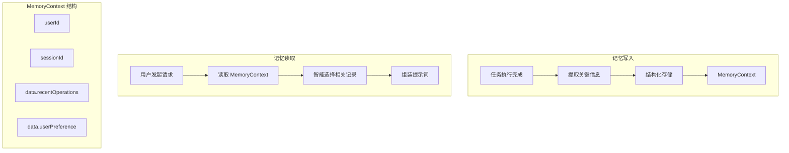
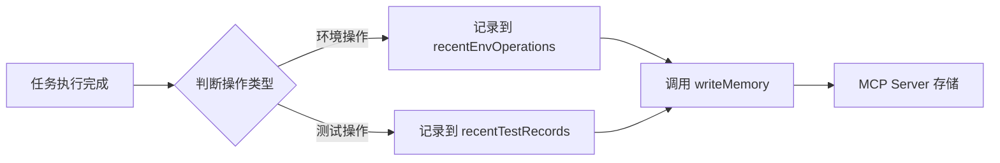
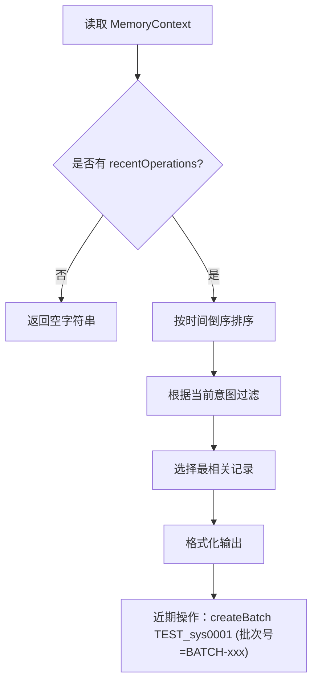
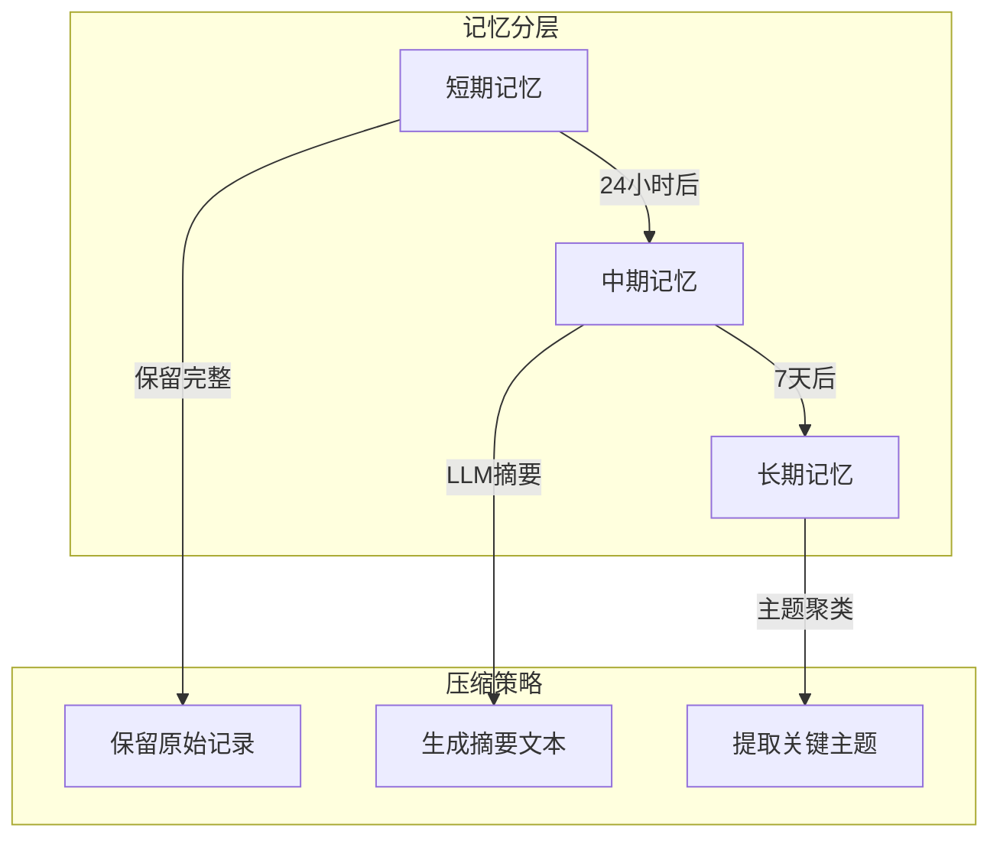

# 研发支持智能体系统架构设计文档

## 1. 系统概述

研发支持智能体系统是一个基于多智能体架构的智能助手平台，旨在帮助用户高效地完成环境管理、测试执行和菜单导航等研发支持任务。系统采用分层架构设计，包含网关层（Gateway）、主控层（MasterAgent）和子智能体层（SubAgent），通过上下文管理机制实现智能对话和任务执行。

## 2. 总体架构

### 2.1 架构分层

```
┌─────────────────────────────────────────────────────────────┐
│                        前端层 (Web UI)                        │
│                  React/Vue 单页应用                           │
└─────────────────────────────────────────────────────────────┘
                              │
                              ▼
┌─────────────────────────────────────────────────────────────┐
│                      网关层 (Gateway)                         │
│  ┌──────────────┐  ┌──────────────┐  ┌──────────────┐      │
│  │ AgentService │  │ MemoryClient │  │  AgentClient │      │
│  └──────────────┘  └──────────────┘  └──────────────┘      │
│       业务编排        记忆读写          子服务调用             │
└─────────────────────────────────────────────────────────────┘
                              │
                              ▼
┌─────────────────────────────────────────────────────────────┐
│                     主控层 (MasterAgent)                      │
│                     Plan-and-Execute                         │
│  ┌──────────────┐  ┌──────────────┐  ┌──────────────┐      │
│  │  任务规划     │  │  智能路由     │  │  结果整合     │      │
│  └──────────────┘  └──────────────┘  └──────────────┘      │
└─────────────────────────────────────────────────────────────┘
                              │
              ┌───────────────┼───────────────┐
              ▼               ▼               ▼
┌─────────────────┐ ┌─────────────────┐ ┌─────────────────┐
│ MenuRecommendation│ │    TestAgent    │ │  EnvManagement  │
│     Agent        │ │                 │ │     Agent       │
│  (菜单推荐)       │ │  (测试执行)      │ │  (环境管理)      │
└─────────────────┘ └─────────────────┘ └─────────────────┘
                              │
                              ▼
┌─────────────────────────────────────────────────────────────┐
│                     工具层 (MCP Server)                       │
│  ┌──────────────┐  ┌──────────────┐  ┌──────────────┐      │
│  │  TestTools   │  │ MemoryService │  │  其他工具     │      │
│  └──────────────┘  └──────────────┘  └──────────────┘      │
└─────────────────────────────────────────────────────────────┘
```

### 2.2 交互流程



## 3. 各组件处理逻辑

### 3.1 Gateway 层处理逻辑

Gateway 是系统的统一入口，负责请求路由、权限控制、和上下文管理等。

#### 3.1.1 核心职责

1. **请求预处理**：接收用户请求，提取用户ID、会话ID等信息
2. **记忆读取**：调用 MemoryClient 读取用户历史记忆
3. **请求组装**：将用户查询与历史记忆组装成带上下文的提示词
4. **智能路由**：根据请求类型决定调用路径
5. **结果缓存**：临时存储意图解析结果，支持多轮交互

#### 3.1.2 特殊处理：菜单推荐的单轮模式

Gateway 对不同类型的智能体采用不同的处理策略：



对于 MenuRecommendationAgent，系统检测到 `action` 以 `recommendMenu` 开头时，会直接调用执行方法并返回结果，跳过参数确认和第二轮交互流程。

### 3.2 MasterAgent 层处理逻辑

MasterAgent 采用 **Plan-and-Execute** 模式，负责任务规划和智能路由。

#### 3.2.1 任务规划流程

```mermaid
<!-- flowchart LR
    A[用户输入] --> B[构建规划提示词]
    B --> C[调用 LLM 分析]
    C --> D[解析任务类型]
    D --> E[确定目标子智能体]
    E --> F[生成 TaskPlan] -->
flowchart TD
    Start([开始]) --> Input[用户输入]
    Input --> Plan[LLM进行任务规划]
    Plan --> Call[调用子智能体]
    Call --> CheckRefuse{子智能体是否<br>拒绝提供服务？}
    
    CheckRefuse -->|是| CheckLoop{循环是否<br>超过2次？}
    CheckRefuse -->|否| CheckOutput{是否有输出结果？}
    
    CheckLoop -->|否| Plan
    CheckLoop -->|是| CheckOutput
    
    CheckOutput -->|是| Integrate[整合结果输出]
    CheckOutput -->|否| Fallback[LLM兜底处理]
    
    Fallback --> Integrate
    Integrate --> End([结束])
```

任务规划时，MasterAgent 会根据关键词匹配规则进行兜底判断：
- **菜单推荐关键词**："菜单"、"推荐"、"在哪"、"怎么"、"如何"
- **环境管理关键词**："环境"、"资源"、"申请"、"回收"
- **测试执行关键词**："测试"、"接口"、"批次"、"案例"、"执行"

#### 3.2.2 路由决策表

| 任务类型 | 目标子智能体 | 需要确认 | 典型场景 |
|---------|-------------|---------|---------|
| MENU_RECOMMENDATION | MenuRecommendationAgent | 否 | "创建批次在哪？" |
| TEST_EXECUTION | TestAgent | 是 | "创建一个测试批次" |
| ENV_MANAGEMENT | EnvManagementAgent | 是 | "申请开发环境" |

### 3.3 MenuRecommendationAgent 处理逻辑

MenuRecommendationAgent 是专门用于菜单推荐的子智能体，其特点是**无状态、单轮交互、直接返回**。

<!-- #### 3.3.1 双重推荐机制


-->

#### 3.3.2 菜单知识库结构

```
接口测试
├── 创建批次 (关键词: 创建批次、新建批次、批次管理)
├── 添加案例到批次 (关键词: 添加案例、加入案例)
├── 执行批次 (关键词: 执行批次、运行批次、开始测试)
└── 分析执行结果 (关键词: 分析结果、查看报告)

环境管理
├── 申请资源 (关键词: 申请环境、创建环境)
├── 回收资源 (关键词: 回收环境、释放资源)
├── 查看资源状态 (关键词: 查看环境、资源状态)
└── 资源续期 (关键词: 续期、延长、扩容)
```

<!-- 置信度计算公式：
- 菜单路径匹配：+0.5
- 关键词匹配：每个 +0.3
- 描述分词匹配：每个 +0.1
- 上限：1.0 -->

置信度计算规则
| 匹配程度 | 置信度范围 | 判定标准 |
|---------|-----------|---------|
| **精确匹配** | 0.90-1.00 | 用户明确说出了菜单完整路径（如"接口测试->创建批次"）或核心动作+对象完全匹配 |
| **高度匹配** | 0.75-0.89 | 用户输入包含菜单的关键要素，关键词匹配度很高，意图非常明确 |
| **中度匹配** | 0.50-0.74 | 用户输入与菜单功能相关，有一定关键词匹配，但意图不是非常明确 |
| **低度匹配** | 0.30-0.49 | 用户输入与菜单功能弱相关，只有个别关键词匹配，可能是相关功能 |
| **不推荐** | <0.30 | 匹配度太低，不要加入推荐列表 |

#### 3.3.3 菜单推荐方案对比

针对菜单推荐功能，存在两种主流的技术实现方案。以下是两种方案的详细处理流程及优缺点对比。

##### 方案一：提示词全量方案（Prompt-based Full Load）

**处理流程：**

```mermaid
<!-- flowchart TD
    A[用户输入查询] --> B[构建系统提示词]
    B --> C[将全部菜单信息<br/>~3万字写入提示词]
    C --> D[调用LLM进行意图理解]
    D --> E{LLM是否返回<br/>有效推荐?}
    E -->|是| F[解析LLM返回的<br/>推荐菜单及置信度]
    E -->|否/置信度过低| G[启动兜底机制]
    G --> H[倒排索引预过滤<br/>从300个筛选到~15个候选]
    H --> I[计算编辑距离+Jaccard相似度]
    I --> J[排序取Top-K推荐]
    F --> K[返回推荐结果]
    J --> K -->
flowchart TD
    A[用户输入查询] --> B{意图识别}
    B --> |提供服务| C[LLM进行意图理解]
    B --> |拒绝服务| D[返回拒绝信息]
    D --> K[输出]
    C --> E{LLM是否返回<br/>有效推荐?}
    E -->|是| F[返回置信度及推荐菜单TOP4]
    E -->|否/置信度过低| G[计算编辑距离+<br/>Jaccard相似度]
    G --> J[排序取推荐菜单Top4]
    F --> K[输出]
    J --> K
```

**兜底处理详细过程：**

当LLM未能给出有效推荐（如返回空、置信度低于阈值0.3，或解析失败）时，系统触发兜底机制：

1. **倒排索引预过滤**：预先建立关键词→菜单ID的倒排索引。用户查询分词后，通过索引快速筛选出包含相关关键词的候选菜单（通常从300个降至10-20个），避免遍历全量菜单。

2. **多维度相似度计算**：对候选菜单计算以下指标：
   - **编辑距离（Levenshtein Distance）**：处理错别字，如"创健"可匹配"创建"
   - **Jaccard相似度**：计算用户查询与菜单描述的词汇集合重叠度
   - **关键词覆盖度**：带TF权重的关键词匹配比例

3. **加权融合排序**：各指标加权融合后排序，取Top-4作为兜底推荐。

**方案一优缺点：**

| 维度 | 优点 | 缺点 |
|------|------|------|
| **实现复杂度** | 架构简单，无需额外组件（向量数据库、Embedding模型） | 兜底机制需要维护倒排索引和相似度计算逻辑 |
| **响应延迟** | LLM一次推理即可完成推荐 | 兜底触发时需要额外计算，延迟增加 |
| **推荐精度** | LLM理解能力强，可处理复杂语义和上下文 | 长文本中间部分易被LLM"遗忘"；兜底仅基于字面匹配，语义理解弱 |
| **可维护性** | 菜单变更只需修改提示词文件 | 提示词过长导致版本管理困难；兜底阈值需反复调优 |
| **成本** | 单次请求成本高（传输3万字） | 虽然上下文足够长，但Token消耗大 |
| **扩展性** | 菜单增至500+时，提示词长度可能超限 | 需提前规划菜单分层或切换方案 |

**适用场景：** 菜单数量较少（<50个）、短期内快速验证POC、对延迟不敏感的场景。

---

##### 方案二：RAG+LLM方案（Retrieval-Augmented Generation）

**处理流程：**

```mermaid
<!-- flowchart TD
    A[用户输入查询] --> B[查询向量化<br/>Embedding Model]
    B --> C[向量数据库检索<br/>ANN近似最近邻]
    C --> D[召回Top-K菜单<br/>通常K=10]
    D --> E[构建增强提示词<br/>用户查询+Top-K菜单]
    E --> F[调用LLM进行精排]
    F --> G{LLM是否返回<br/>有效推荐?}
    G -->|是| H[返回LLM精排结果]
    G -->|否| I[启动兜底机制]
    I --> J[基于倒排索引的<br/>字面匹配兜底]
    J --> K[返回兜底推荐]
    H --> L[返回最终结果]
    K --> L -->
flowchart TD
    A[用户输入查询] --> B{意图识别}
    B -->|提供服务| E[RAG检索]
    B -->|拒绝服务| C[返回拒绝信息]
    C --> K[输出]
    E --> F[LLM进行菜单推荐]
    F --> G{LLM是否返回<br>有效推荐?}
    G -->|是| H[返回置信度及推荐菜单TOP4]
    G -->|否/置信度过低| I[计算编辑距离+<br>Jaccard相似度]
    I --> J[排序取推荐菜单Top4]
    H --> K
    J --> K
    K --> L([结束])
```

**RAG核心组件：**

1. **向量数据库（Vector Store）**：预先存储所有菜单的向量表示，支持高效的ANN（Approximate Nearest Neighbor）检索。

2. **Embedding模型**：将用户查询和菜单文本转换为高维向量（通常768或1024维），如BGE、M3E等中文Embedding模型。

3. **检索策略**：
   - 纯向量检索：语义相似度匹配，可处理同义词（如"申请"≈"创建"）
   - 混合检索：向量检索 + BM25关键词检索，两者结果融合后送入LLM

**兜底处理详细过程：**

RAG方案的兜底与方案一类似，但触发概率更低：

1. **触发条件**：向量检索召回为空（相似度均低于阈值，如0.5），或LLM对召回结果均不认可。

2. **兜底计算**：由于RAG已过滤掉大部分不相关菜单，兜底可基于倒排索引快速定位候选，或直接遍历剩余候选（数量已很少）。

3. **优化策略**：可在向量检索阶段设置较低阈值确保召回率，让LLM负责精排，减少兜底触发频率。

**方案二优缺点：**

| 维度 | 优点 | 缺点 |
|------|------|------|
| **实现复杂度** | 架构解耦，菜单管理独立 | 需引入向量数据库和Embedding模型，组件增多 |
| **响应延迟** | 向量检索毫秒级，LLM处理Token数少（~500字），整体响应快 | 首次查询需预热向量库；网络开销增加 |
| **推荐精度** | 向量检索捕捉语义关系（同义词、近义词）；LLM专注精排，精度高 | Embedding模型质量影响检索效果；需定期更新向量 |
| **可维护性** | 菜单变更只需更新向量库，无需修改提示词 | 需维护向量库和Embedding模型版本 |
| **成本** | LLM请求Token数大幅减少（从3万字到500字），成本显著降低 | 向量库存储和检索有额外成本 |
| **扩展性** | 支持大规模菜单（数千个），检索延迟对数增长 | 需定期重建索引；超大规模需分片 |

**适用场景：** 生产环境、菜单数量大（>100个）、追求响应速度和推荐精度、长期维护的项目。

---

##### 方案对比总结

| 对比维度 | 方案一：提示词全量 | 方案二：RAG+LLM |
|---------|------------------|----------------|
| **核心思想** | LLM直接阅读全部菜单后推荐 | 先检索候选，LLM再精排 |
| **LLM负载** | 高（处理3万字） | 低（处理500字） |
| **语义理解** | 强（LLM完整理解） | 中等（依赖Embedding） |
| **兜底频率** | 较高（LLM易遗漏中间菜单） | 较低（检索确保高召回） |
| **实现成本** | 低（无额外组件） | 高（需向量基础设施） |
| **长期维护** | 困难（提示词膨胀） | 容易（模块化架构） |
| **推荐选型** | POC/小规模 | 生产/大规模 |

**建议演进路线：**
- **阶段1（当前）**：采用方案一快速验证，菜单量控制在50个以内
- **阶段2（扩展）**：引入倒排索引预过滤，支持300个菜单
- **阶段3（生产）**：切换至方案二（RAG+LLM），支撑数千菜单规模

### 3.4 TestAgent 处理逻辑

TestAgent 是处理测试相关任务的子智能体，采用 **ReAct（Reasoning + Acting）** 模式。

#### 3.4.1 两阶段处理流程

**第一阶段：意图解析（Intent Parse）**
1. 构建提示词（包含系统提示词 + 用户查询 + 历史记忆）
2. 调用 LLM 解析用户意图
3. 提取 action、parameters、think 等信息
4. 返回结构化结果，包含参数确认表单

**第二阶段：任务执行（Execution）**
1. 接收用户确认后的参数
2. 根据 action 调用对应的 MCP 工具
3. 处理工具返回结果
4. 格式化输出给用户

#### 3.4.2 支持的操作类型

| Action | MCP 工具 | 功能描述 |
|-------|---------|---------|
| createBatch | createBatch | 创建测试批次 |
| addCasesToBatch | addCasesToBatch | 添加案例到批次 |
| executeBatch | executeBatch | 执行测试批次 |
| analyzeBatchResult | analyzeBatchResult | 分析执行结果 |
| autoInterfaceTest | autoInterfaceTest | 自动化接口测试 |



## 4. 上下文管理设计

### 4.0 上下文管理的由来与必要性

#### 什么是上下文工程（Context Engineering）

在构建基于大模型的智能体系统时，上下文工程（Context Engineering）是系统设计的核心挑战。根据Anthropic在[《Effective context engineering for AI agents》](https://www.anthropic.com/engineering/effective-context-engineering-ai-agents)中的定义，**上下文工程是"设计、构建和维护AI系统上下文窗口内容的过程，旨在最大化模型性能、可靠性和效率"**。

正如前OpenAI研究员Andrej Karpathy说上下文工程是将恰到好处的信息填充到上下文窗口中以供下一步LLM使用的精妙艺术和科学，在其关于["LLM OS"](https://twitter.com/karpathy/status/1723147342651404612)的论述中指出的，LLM相当于CPU‌：负责执行计算与推理，是核心处理单元；上下文窗口相当于RAM‌：提供有限的工作记忆，用于存放当前任务所需的信息（如指令、历史对话、检索结果等），但容量和带宽受限。‌上下文工程相当于OS‌：负责‌高效管理、调度和优化‌哪些信息应被加载到“RAM”（上下文窗口）中、何时加载、以何种格式呈现，从而让 LLM 能够稳定、高效地完成复杂任务。

**上下文工程包含的核心组成部分：**

| 组成部分 | 描述 | 设计考量 |
|---------|------|---------|
| **系统提示词（System Prompt）** | 定义AI角色、能力和约束的静态指令 | 需要精简、明确、稳定 |
| **对话历史（Conversation History）** | 用户与AI的交互记录 | 需要选择性保留，避免信息过载 |
| **工具上下文（Tool Context）** | 可用工具的描述和调用结果 | 动态变化，需要按需加载 |
| **外部知识（External Knowledge）** | RAG检索的文档、记忆系统等 | 需要精准检索，避免无关信息 |
| **运行时状态（Runtime State）** | 当前任务进度、中间变量等 | 需要结构化存储，便于追踪 |

---

#### 上下文工程的核心约束：上下文腐烂（Context Rot）

随着对话轮次的增加，系统面临着Anthropic所描述的**"上下文腐烂"（Context Rot）**问题——即上下文质量随时间推移而逐渐下降的现象。这不是简单的"窗口满了"的技术限制，而是**信息质量劣化**的系统性问题。

上下文腐烂的根源在于：
1. **信息过载**：大量历史信息稀释了重要信号的浓度
2. **语义漂移**：早期对话的语义与当前任务逐渐脱节
3. **噪声累积**：错误、冗余、临时的信息不断堆积
4. **注意力分散**：模型难以在庞大上下文中保持焦点

---

#### 上下文引发的四类具体问题

上下文腐烂在实际系统中表现为四类具体问题，Anthropic和LangChain的研究均对此有深入分析：

**1. 上下文污染（Context Pollution）**

指历史记录中混入了无关或低质量的信息，导致模型输出质量下降。

*典型场景：* 用户在十轮前临时询问"今天天气如何"，这个闲聊记录被保留下来。当后续用户询问"执行批次"时，模型可能错误地认为天气与批次执行有关，或在思考过程中被分散注意力。

*根本原因：* **全量记录策略**——不加选择地将所有对话写入上下文，没有区分信息的相关性和重要性。

**2. 上下文干扰（Context Interference）**

指相关信息因呈现方式不当而被模型忽略或误解，有用信号被噪声淹没。

*典型场景：* 用户创建批次A后，又创建了批次B、C、D。当用户说"查看刚才那个批次的结果"时，模型面对四个批次的历史记录，难以确定"刚才那个"指的是哪一个（时间最近？还是对话中最后提及的？）。

*根本原因：* **缺乏语义组织**——平铺直叙的历史记录没有建立信息之间的关联和优先级。

**3. 上下文混淆（Context Confusion）**

指实体指代关系模糊，模型无法准确解析代词、省略语等的具体指向。

*典型场景：* 用户说："创建批次A，添加案例X，执行它，然后删除它。"这里的两个"它"分别指代什么？第一个"它"可能指批次A，第二个"它"可能指案例X——但如果上下文组织不当，模型可能理解错误，导致删除整个批次而非单个案例。

*根本原因：* **指代消解失败**——缺乏对实体生命周期和作用域的精确追踪。

**4. 上下文冲突（Context Conflict）**

指历史记录中的信息相互矛盾，导致模型产生不一致的输出或陷入困惑。

*典型场景：* 用户在第5轮说"系统名是sys001"，在第15轮说"系统名是sys002"（纠正了之前的错误）。如果两条记录都被保留且权重相同，模型可能随机选择其中一个，或要求用户再次确认——浪费交互轮次。

*根本原因：* **缺乏时效性和冲突解决机制**——没有区分信息的有效期限，也没有处理更新和覆盖的逻辑。

---

#### 上下文窗口的物理限制

除了上述质量问题，系统还面临着物理层面的约束。尽管现代LLM（如GPT-4、Claude 3）拥有长达128K tokens的上下文窗口，但正如LangChain团队在[《Context Engineering》](https://blog.langchain.dev/context-engineering/)一文中指出的，**"能够放入上下文的≠能够有效利用的"**。

研究表明，模型的注意力机制对长文本中间部分的关注度会显著下降，导致"中间遗忘"（Lost in the Middle）现象。此外，Anthropic在[《Building effective AI agents》](https://www.anthropic.com/research/building-effective-agents)中强调，无节制的上下文堆积会导致：
- **Token成本线性增长**：每次请求的费用随上下文长度增加
- **响应延迟显著增加**：模型处理长文本的时间成本
- **推理质量下降**：关键信息被淹没在噪声中

---

#### 上下文工程的核心目标

根据LangChain的Context Engineering框架和Anthropic的最佳实践，高效的上下文管理需要实现四大核心操作：

| 核心操作 | 目标 | 解决痛点 | 对应问题 |
|---------|------|---------|---------|
| **写入（Write）** | 选择性地记录关键信息 | 避免记录无用信息 | 污染 |
| **选择（Select）** | 从大量历史中筛选相关内容 | 解决上下文过长 | 干扰 |
| **压缩（Compress）** | 对历史进行摘要或向量化 | 解决窗口限制 | 腐烂 |
| **隔离（Isolate）** | 区分不同用户、会话、请求的上下文 | 解决混淆和冲突 | 混淆、冲突 |

本系统的上下文管理设计正是围绕这四大操作展开的，下文将详细介绍我们的具体实现方案。

---

### 4.1 业界上下文管理方案

在对话系统和智能助手领域，上下文管理是核心能力。以下方案参考自业界主流实践和相关技术文献。

#### 4.1.1 OpenAI 的 Conversation 模式

**参考来源：**
- OpenAI API官方文档: [Chat Completions API](https://platform.openai.com/docs/guides/chat-completions)
- OpenAI Cookbook: [Managing Context Windows](https://github.com/openai/openai-cookbook/blob/main/examples/How_to_count_tokens_with_tiktoken.ipynb)

**核心机制：**
- 维护固定窗口的历史消息列表
- 支持 system/user/assistant/tool 四种角色
- 超出窗口时丢弃早期消息

**局限性：** 简单的FIFO丢弃策略无法区分信息重要性，易丢失关键上下文。

#### 4.1.2 LangChain 的 Memory 模块

**参考来源：**
- LangChain官方文档: [Memory](https://python.langchain.com/docs/concepts/memory/)
- LangChain博客: [Context Engineering](https://blog.langchain.dev/context-engineering/)
- LangChain论文: [Memory in LLM Applications](https://blog.langchain.dev/memory-in-llm-applications/)

**核心实现（对应Context Engineering四大操作）：**

| Memory类型 | 核心操作 | 机制描述 |
|-----------|---------|---------|
| **BufferMemory** | 写入 | 保留完整对话历史，全量写入 |
| **BufferWindowMemory** | 选择 | 保留最近K轮对话，滑动窗口选择 |
| **SummaryMemory** | 压缩 | 使用LLM对历史进行摘要，文本压缩 |
| **VectorStoreMemory** | 选择+压缩 | 基于向量检索的相关历史，语义选择+向量化压缩 |

**技术优势：** 提供了模块化的Memory接口，开发者可根据场景选择合适策略。

#### 4.1.3 Anthropic的上下文工程实践

**参考来源：**
- Anthropic Research: [Building effective AI agents](https://www.anthropic.com/research/building-effective-agents)
- Anthropic Cookbook: [Contextual Retrieval](https://github.com/anthropics/anthropic-cookbook/blob/main/skills/contextual-embeddings/guide.ipynb)

**核心观点：**
- 简单的RAG往往不够，需要**Contextual Retrieval**（上下文检索）
- 建议在向量化前，先使用LLM为每个文档块生成上下文说明
- 强调**分层的上下文管理**：系统级、会话级、工具级三层隔离

#### 4.1.4 长文本处理方案

**参考来源：**
- Google Research: [RAG vs Long Context](https://arxiv.org/abs/2407.16833)
- Microsoft Research: [Long Context LLM Survey](https://arxiv.org/abs/2312.10997)

**主流技术路线：**

- **RAG（Retrieval-Augmented Generation）**：向量检索 + 生成
  - 优势：不受上下文窗口限制，成本低
  - 劣势：检索质量依赖Embedding模型
  
- **滑动窗口（Sliding Window）**：固定窗口大小，丢弃过期内容
  - 优势：实现简单，确定性强
  - 劣势：粗暴丢弃可能丢失关键信息
  
- **分层摘要（Hierarchical Summarization）**：短、中、长期记忆分层管理
  - 优势：兼顾细节和宏观
  - 劣势：需要额外的LLM调用成本

### 4.2 本系统的上下文管理实现

本系统采用 **结构化记忆 + 语义检索** 的混合方案：



#### 4.2.1 记忆数据结构

```
MemoryContext
├── userId: 用户唯一标识
├── sessionId: 会话标识（支持会话隔离）
├── historyTasks: 历史任务列表
├── recentEnvOperations: 近期环境操作
├── recentTestRecords: 近期测试记录
├── userPreference: 用户偏好设置
└── data: 扩展数据字段
    ├── recentOperations: 通用操作记录
    │   ├── action: 操作类型
    │   ├── target: 操作目标
    │   ├── result: 执行结果
    │   └── timestamp: 时间戳
    └── userPreference: 偏好设置
```

#### 4.2.2 写入逻辑



写入时机的选择：
- **优势**：在执行完成后写入，确保记录的是真实发生的操作
- **考虑**：失败操作也会被记录，便于用户了解历史尝试

#### 4.2.3 读取与格式化逻辑



智能选择策略：
1. **时间倒序**：优先显示最近的操作
2. **意图匹配**：根据当前查询关键词匹配相关操作
3. **成功优先**：在相关记录中优先选择成功的操作
4. **单条展示**：避免过多历史信息干扰

#### 4.2.4 上下文隔离机制

| 隔离级别 | 实现方式 | 适用场景 |
|---------|---------|---------|
| 用户级别 | userId 区分 | 跨会话的记忆共享 |
| 会话级别 | sessionId 区分 | 单次对话的临时状态 |
| 请求级别 | requestId 区分 | 单次请求的临时缓存 |

### 4.3 上下文压缩扩展计划

当前系统暂未实现上下文压缩，随着用户使用时间增长，记忆数据会不断累积，可能导致以下问题：
- 提示词过长，超出 LLM 上下文窗口限制
- 噪声信息增多，干扰模型判断
- 响应延迟增加

#### 4.3.1 压缩策略设计

**方案一：分层摘要（推荐）**



实现思路：
- **短期记忆**（0-24小时）：保留完整操作记录，支持细节查询
- **中期记忆**（1-7天）：使用 LLM 生成摘要，保留关键信息
- **长期记忆**（7天+）：主题聚类，仅保留高频操作模式和用户偏好

**方案二：向量化检索**

```
用户查询 -> 向量化
                ↓
          向量数据库（Chroma/Milvus）
                ↓
         相似度检索 Top-K
                ↓
         返回最相关的历史记录
```

优势：
- 不受固定窗口限制
- 语义相关性强
- 可扩展性好

**方案三：关键信息提取**

在写入时即进行信息提取，只存储结构化关键字段：
```json
{
  "operation": "createBatch",
  "keyInfo": {
    "batchId": "BATCH-xxx",
    "systemName": "sys0001"
  },
  "outcome": "success",
  "timestamp": "2024-01-01T12:00:00"
}
```

#### 4.3.2 实施路线图

| 阶段 | 功能 | 优先级 |
|-----|------|-------|
| 短期 | 实现基于时间的滑动窗口，自动清理 30 天前的记录 | 高 |
| 中期 | 引入 LLM 摘要，将 7 天前的记录压缩为摘要 | 中 |
| 长期 | 集成向量数据库，实现语义检索 | 低 |

## 5. 总结

研发支持智能体系统通过分层架构实现了任务的智能分解和高效执行。Gateway 层负责请求编排和上下文管理，MasterAgent 负责任务规划和路由决策，各子智能体专注特定领域的任务处理。

上下文管理采用结构化存储 + 智能检索的方案，在满足当前需求的同时预留了压缩扩展的接口。未来可通过分层摘要、向量化检索等技术进一步优化长程对话体验。

系统的设计充分考虑了不同智能体的特性差异，如 MenuRecommendationAgent 的单轮模式、TestAgent 的两轮确认模式，实现了灵活与规范的平衡。
