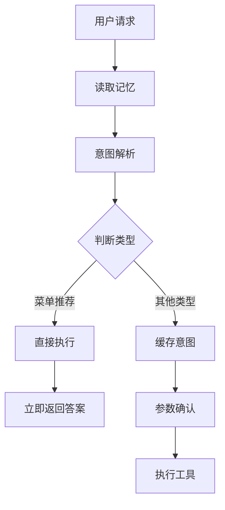

# 研发支持智能体系统架构设计方案演讲稿

## 开场

各位领导、各位同事，大家好！今天我来向大家汇报我们研发的智能体系统架构设计方案。

在数字化转型的大趋势下，企业内部的研发支持系统面临着效率提升的迫切需求。传统的研发支持系统往往是"菜单式"的，用户需要记住功能入口、理解专业术语，学习成本很高。我们的目标是构建一个基于大模型的智能助手，让用户可以用自然语言与系统交互，降低使用门槛，提升工作效率。

接下来，我将从系统架构、核心流程、上下文管理等方面，详细介绍我们的设计方案。

## 第一部分：总体架构设计

### 1.1 分层架构思想

我们的系统采用经典的分层架构，从上到下分为四层：前端层、网关层、主控层和子智能体层。

```
前端层 -> 网关层 -> 主控层 -> 子智能体层 -> 工具层
```

这种分层设计有几个核心优势：

**第一，关注点分离。** 每一层只关注自己的职责。前端层专注用户交互体验；网关层专注请求编排和协议转换；主控层专注任务规划和路由决策；子智能体层专注具体业务逻辑的执行。

**第二，可扩展性。** 当我们需要增加新的智能体时，只需要在子智能体层添加实现，主控层通过配置即可接入，不需要修改其他层的代码。

**第三，可维护性。** 每一层的逻辑相对独立，出现问题时可以快速定位到具体层次。

### 1.2 架构对比业界实践

这种分层架构与业界的主流做法是一致的。比如 OpenAI 的 GPTs 系统，也是采用类似的架构：用户请求先经过网关层，然后路由到不同的 GPT 应用，每个 GPT 应用内部有自己的业务逻辑和工具调用能力。

LangChain 框架也倡导这种分层思想，他们的架构分为：Chains（业务编排）、Agents（任务规划）、Tools（工具层）。我们的架构可以看作是对 LangChain 思想的一种工程化落地。

## 第二部分：核心流程详解

### 2.1 网关层：智能路由与编排

网关层是整个系统的"大脑皮层"，它决定了用户请求应该如何处理。这里有一个关键的设计决策：**不同类型的智能体采用不同的交互模式**。

我们来看流程图：



为什么会有这样的区分？

菜单推荐是一个**纯信息查询**的场景，用户问"创建批次在哪？"，系统只需要告诉用户菜单路径即可，不需要确认参数，也不需要调用外部工具。这种情况下如果还要走两轮交互，用户体验会很差。

但测试执行不同。用户说"创建一个批次"，系统需要确认：系统名是什么？系统编号是什么？批次标识是什么？这些参数必须明确，否则无法执行。这时候就需要两轮交互：第一轮解析意图并收集参数，第二轮用户确认后执行。

这种设计体现了**场景化思维**，不是一刀切地套用统一的交互模式，而是根据业务场景的特点选择最合适的交互方式。

### 2.2 MasterAgent：Plan-and-Execute 模式

MasterAgent 是系统的"中央指挥官"，它采用了业界流行的 Plan-and-Execute 模式。

什么是 Plan-and-Execute？简单来说就是"先规划，后执行"。当用户发来一个请求，MasterAgent 不会立即执行，而是先进行任务规划：

1. **理解用户意图**：用户想做什么？
2. **确定任务类型**：这是环境管理、测试执行，还是菜单推荐？
3. **选择执行主体**：应该由哪个子智能体来处理？
4. **评估执行策略**：是否需要参数确认？

这个规划过程我们使用大模型来完成。系统提示词中定义了任务类型和路由规则，大模型根据用户输入输出任务规划结果。

这里有一个**兜底机制**值得注意。如果大模型因为某些原因没有返回有效结果，或者返回了无法解析的内容，系统会启动关键词匹配作为兜底策略。比如用户输入包含"环境"、"资源"、"申请"等关键词，即使大模型没有正确识别，系统也会路由到环境管理智能体。

这种"大模型+规则兜底"的混合策略，既保证了对复杂意图的理解能力，又确保了系统的稳定性和可靠性。

### 2.3 MenuRecommendationAgent：单轮无状态设计

MenuRecommendationAgent 是我们系统中最轻量级的智能体，它的特点是**单轮交互、无状态、直接返回答案**。

让我们看看它的核心机制——**双重推荐**：

**第一层是 LLM 推荐。** 我们将菜单知识库和用户查询一起送入大模型，让大模型理解用户意图并推荐最合适的菜单。这种方式的优势是理解能力强，可以处理复杂的、模糊的表达。

**第二层是关键词匹配兜底。** 如果 LLM 没有返回有效的推荐结果，或者用户查询比较简单明确，我们会启动关键词匹配机制。系统遍历内置的菜单知识库，计算每个菜单的匹配置信度，排序后返回 Top5。

置信度计算公式是：
- 菜单路径匹配：+0.5
- 关键词匹配：每个 +0.3  
- 描述分词匹配：每个 +0.1

举个例子，用户说"我想创建批次"。系统会匹配到：
- "接口测试->创建批次"：路径中包含"创建批次"，置信度 0.5
- "测试管理->创建测试计划"：关键词"创建"匹配，置信度 0.3

这样即使 LLM 不可用，系统也能给出合理的推荐。

### 2.4 TestAgent：ReAct 模式与工具调用

TestAgent 采用 ReAct（Reasoning + Acting）模式，这是业界处理复杂任务的经典模式。

ReAct 模式的核心思想是：**推理和行动交替进行**。智能体首先进行推理（Reasoning），理解用户意图并确定行动计划；然后执行行动（Acting），调用工具完成任务；根据执行结果再次推理，决定下一步行动，如此循环直到任务完成。

在我们的系统中，ReAct 模式简化为两阶段：

**第一阶段：意图解析（Reasoning）**
- 构建提示词（系统提示词 + 用户查询 + 历史记忆）
- 调用 LLM 解析意图
- 提取 action、parameters、think（思考过程）
- 返回结构化结果，包含参数确认表单

**第二阶段：工具执行（Acting）**
- 接收用户确认后的参数
- 根据 action 调用对应的 MCP 工具
- 处理工具返回结果
- 格式化输出给用户

这里涉及到与 MCP Server 的交互。MCP（Model Context Protocol）是一个标准化的协议，用于连接大模型和外部工具。TestAgent 通过 MCP 调用创建批次、添加案例、执行测试等工具，实现从"理解"到"执行"的闭环。

这种设计借鉴了 AutoGPT 和 LangChain Agent 的思想。AutoGPT 也是采用类似的循环：思考 -> 执行 -> 观察 -> 再思考。我们的实现相对简化，但核心思想是一致的。

## 第三部分：上下文管理——系统的"记忆系统"

上下文管理是智能体系统的核心能力之一，也是我今天要重点展开的部分。

### 3.1 为什么上下文管理如此重要？

想象这样一个场景：用户第一轮说"创建一个测试批次"，系统返回了批次号 BATCH-001。第二轮用户说"把案例 case01 加到这个批次里"。

如果没有上下文管理，系统会问："您要添加到哪个批次？"用户不得不重复 BATCH-001。这种体验显然很糟糕。

有了上下文管理，系统应该能自动理解"这个批次"指的是 BATCH-001。这就是记忆的价值——**让系统保持对话的连贯性，减少用户的重复输入**。

### 3.2 业界的上下文管理实践

在介绍我们的方案之前，先看看业界的大佬们是怎么做的。

#### 3.2.1 Andrej Karpathy 的 LLM OS 思想

Andrej Karpathy（卡帕西），前 OpenAI 研究员、特斯拉 AI 总监，他在 2023 年提出了"LLM OS"的概念。他把大模型比作操作系统内核，上下文就是内核的状态空间。

卡帕西强调，一个强大的 LLM 系统需要：
- **短期记忆**：当前对话的上下文窗口
- **长期记忆**：可以持久化存储的用户数据
- **工具调用**：类似操作系统的系统调用

他的思想深深影响了业界的架构设计。我们的系统也可以看作是一个简化版的 LLM OS：MasterAgent 是内核，上下文管理是内存管理，MCP 工具是系统调用。

#### 3.2.2 OpenAI 的 Conversation 模式

OpenAI 的 GPT 系列模型原生支持对话模式。开发者只需要维护一个消息列表，包含 system、user、assistant、tool 四种角色的消息。

```json
[
  {"role": "system", "content": "你是助手..."},
  {"role": "user", "content": "创建一个批次"},
  {"role": "assistant", "content": "已创建批次 BATCH-001"},
  {"role": "user", "content": "添加案例到这个批次"}
]
```

模型的注意力机制会自动处理这个序列，理解对话的上下文关系。

但这种模式有一个根本限制：**上下文窗口有限**。GPT-4 是 128K，GPT-3.5 是 16K。当对话历史超过这个限制，早期的消息就会被丢弃。

#### 3.2.3 LangChain 的 Memory 模块

LangChain 作为业界最流行的 LLM 应用框架，提供了丰富的 Memory 实现：

**BufferMemory**：最简单的实现，直接保留完整对话历史。优点是不会丢失信息，缺点是很快就会撑爆上下文窗口。

**BufferWindowMemory**：滑动窗口机制，只保留最近 K 轮对话。这是最常见的做法，也是 OpenAI 官方推荐的方式。

**SummaryMemory**：使用另一个 LLM 调用对历史对话进行摘要。比如把 10 轮对话压缩成一段话："用户创建了批次 BATCH-001，添加了案例 case01，然后执行了测试。"这种方式可以保留更长的历史，但会丢失细节。

**VectorStoreMemory**：基于向量检索的记忆。把所有的历史消息向量化，存入向量数据库。当新的查询进来时，先做向量检索，找出最相关的历史记录，然后只把这些相关记录放入上下文。这种方式不受窗口限制，但依赖于向量检索的准确性。

#### 3.2.4 RAG（检索增强生成）

RAG 是另一种处理长上下文的思路。它把外部知识库向量化，查询时先检索最相关的文档片段，然后把这些片段作为上下文送入大模型。

RAG 和 Memory 的区别在于：Memory 是"对话历史"，RAG 是"知识库"。但在工程实践中，两者的界限越来越模糊。可以把 Memory 看作是一个动态的、个性化的知识库。

### 3.3 我们的上下文管理方案

结合业界的最佳实践，我们设计了一套混合方案：**结构化记忆 + 智能选择**。

#### 3.3.1 数据结构：结构化的 MemoryContext

我们不直接存储原始对话记录，而是存储**结构化的操作记录**：

```json
{
  "userId": "user_001",
  "sessionId": "session_xxx",
  "data": {
    "recentOperations": [
      {
        "action": "createBatch",
        "target": "TEST_sys0001",
        "result": {"batchId": "BATCH-001", "success": true},
        "timestamp": "2024-01-01T12:00:00"
      }
    ],
    "userPreference": {
      "defaultEnvType": "development"
    }
  }
}
```

这种结构化的好处是：
- **存储效率高**：不需要存储完整的对话文本
- **检索效率高**：可以直接按 action、target 等字段过滤
- **语义清晰**：每个字段都有明确的业务含义

#### 3.3.2 写入逻辑：执行后写入

我们选择在**任务执行完成后**写入记忆，而不是在对话过程中实时写入。

为什么这样设计？

假设用户说"创建一个批次"，系统正在解析意图，这时候如果写入记忆，记录的是"用户说要创建批次"。但如果用户最后取消了操作，这个记忆就变成了噪声。

执行后写入确保记录的是**真实发生的操作**，记忆的质量更高。

#### 3.3.3 读取逻辑：智能选择而非全量加载

这是与业界方案最大的不同之处。

大多数系统（包括 LangChain 的 BufferMemory）都是把历史记录全量加载到上下文。我们采用的是**智能选择策略**：

1. **时间倒序排序**：最近的操作最相关
2. **意图匹配过滤**：根据当前查询的关键词，筛选出相关的操作
3. **成功记录优先**：失败的操作参考价值较低
4. **单条展示**：只选择最相关的一条，避免信息过载

举个例子：
- 用户当前说"把案例加到这个批次里"
- 系统从记忆中找到最近的操作是"createBatch TEST_sys0001"
- 匹配成功，系统知道"这个批次"指的是 TEST_sys0001 对应的批次
- 组装提示词："近期操作：createBatch TEST_sys0001 (批次号=BATCH-001)。当前需求：把案例加到这个批次里"

这样大模型就能理解"这个批次"的指代关系。

#### 3.3.4 隔离机制：三层隔离

我们实现了三层隔离机制，适应不同的业务场景：

**用户级别隔离**：通过 userId 区分不同用户。用户 A 的操作记录不会出现在用户 B 的记忆中。

**会话级别隔离**：通过 sessionId 区分不同会话。用户开启新会话时，可以选择是否携带历史会话的记忆。

**请求级别隔离**：通过 requestId 区分单次请求。主要用于临时缓存，比如第一轮意图解析的结果，在第二轮执行时使用。

这种设计参考了分布式系统中的多租户架构，确保了数据的安全性和隔离性。

### 3.4 未来演进：上下文压缩

当前方案有一个限制：随着时间的推移，记忆数据会不断累积。虽然我们的智能选择策略可以缓解这个问题，但根本的解决方案是**上下文压缩**。

我们规划了三阶段的演进路线：

**短期（已实现基础版）**：基于时间的滑动窗口，自动清理 30 天前的记录。这是最简单有效的方案。

**中期（规划中）**：引入 LLM 摘要。对于 7 天前的记录，使用另一个 LLM 调用生成摘要。比如把 10 条操作记录压缩成："用户在本周创建了 3 个批次，主要测试 sys0001 系统。"这样既保留了关键信息，又减少了存储空间。

**长期（规划中）**：集成向量数据库。借鉴 LangChain VectorStoreMemory 的思路，把所有的操作记录向量化。查询时先做向量检索，只把最相关的记录放入上下文。这种方式不受窗口限制，但会增加系统的复杂度。

## 第四部分：技术创新点与价值

最后，我想总结一下我们方案的几个技术创新点：

### 4.1 场景化的交互模式

不是一刀切地套用统一的交互模式，而是根据业务场景的特点选择最合适的模式。菜单推荐单轮、测试执行两轮，这种**差异化设计**大大提升了用户体验。

### 4.2 双重保障的智能路由

大模型负责理解复杂意图，关键词匹配兜底确保稳定性。这种"智能+规则"的混合策略，兼顾了准确性和可靠性。

### 4.3 结构化的记忆管理

不同于业界常见的原始对话存储，我们采用结构化的操作记录，配合智能选择策略，实现了高效、精准的记忆利用。

### 4.4 渐进式的架构演进

系统架构预留了扩展接口，上下文压缩、向量检索等高级特性可以逐步引入，不影响现有功能的稳定性。

## 结语

研发支持智能体系统的架构设计，融合了业界的前沿实践和我们自己的创新思考。我们相信，这套架构能够支撑起一个高效、智能、用户友好的研发支持平台。

当然，架构设计只是第一步，真正的挑战在于落地和迭代。我们期待与各位同事一起，把这个系统打造得更加完善。

我的汇报到此结束，谢谢大家！欢迎提问和交流。
